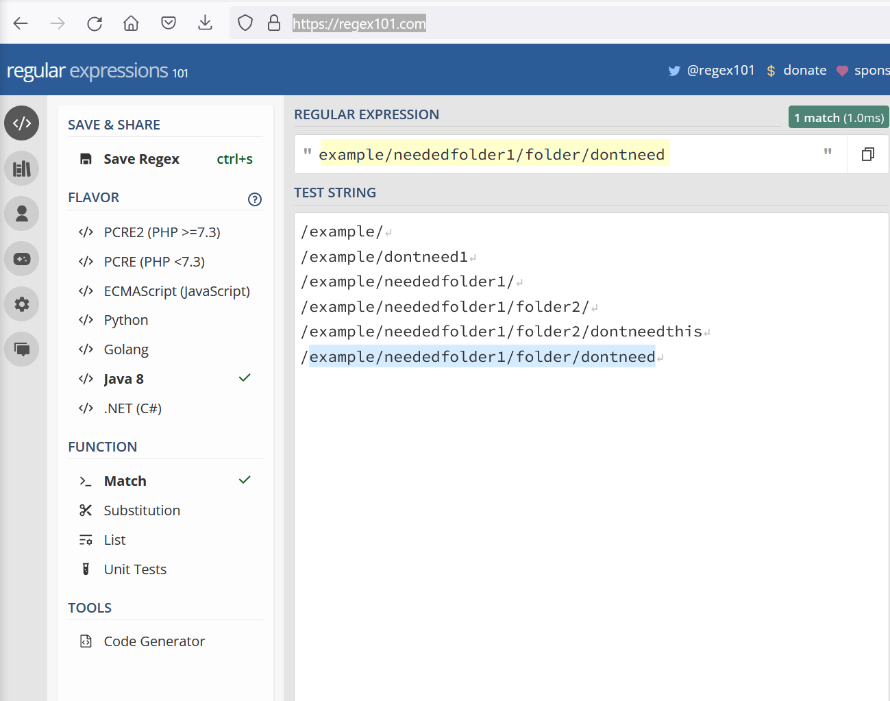

# LDM, adding more precise exclusion example.

Do these examples in a test directory or lab until fully accurate.

### 1. Pick a test directory.
```
/example
/example/dontneed1
/example/neededfolder1
/example/neededfolder1/folder
/example/neededfolder1/folder/dontneed
/example/neededfolder1/folder2
/example/neededfolder1/folder2/dontneedthis
/example/neededfolder2
```

We will exclude '/example/neededfolder1/folder/dontneed' but keep 'dontneed1' and 'dontneedthis'
We want the match only on the absolute folder.

### 2. Confirm the correct regex.

Get the correct regex, you can use https://regex101.com/. Or any other regex tester tool.




For the curl command we can change the '/' characters to URL encoded character

See https://www.w3schools.com/tags/ref_urlencode.ASP for a list of all URL encoded characters.

### 3. Add the exclusion template with url encoded characters. 
```
curl -X 'PUT' "http://10.6.123.132:18080/exclusions/regex/example_exclusion?description=example_exclusion&patternType=JAVA_PCRE&regex=example%2Fneededfolder1%2Ffolder%2Fdontneed"
```

:question:
**Note:** You can do the same for 700 exclusions with the while loop and text file containing all patterns with '%2F' replacing the '/' characters.


### 4. Create the migration rule for path = /example
```
curl -X 'PUT' 'http://10.6.123.132:18080/migrations/example?path=/example&source=SourceHDFS&target=TragetHDFS&actionPolicy=com.wandisco.livemigrator2.migration.OverwriteActionPolicy&autoStart=false'
```
### 5. Add your exclusions to the migration rule = example
```
curl -X 'PUT' "http://10.6.123.132:18080/migrations/example/exclusions/example_exclusion"
```
### 6. Run the migration.
```
curl -X 'POST' 'http://10.6.123.132:18080/migrations/example/start'
```

### 7. Check the target.
```
hdfs dfs -ls -R /example
```

### Reset
```
curl -X 'POST' 'http://10.6.123.132:18080/migrations/example/stop'
curl -X 'DELETE' 'http://10.6.123.132:18080/migrations/example'
curl -X 'DELETE' "http://10.6.123.132:18080/exclusions/example_exclusion"
curl -s -X 'GET' 'http://10.6.123.132:18080/exclusions/userDefined'
hdfs dfs -rm -r /example
```

### References
https://regex101.com/

https://www.w3schools.com/tags/ref_urlencode.ASP

